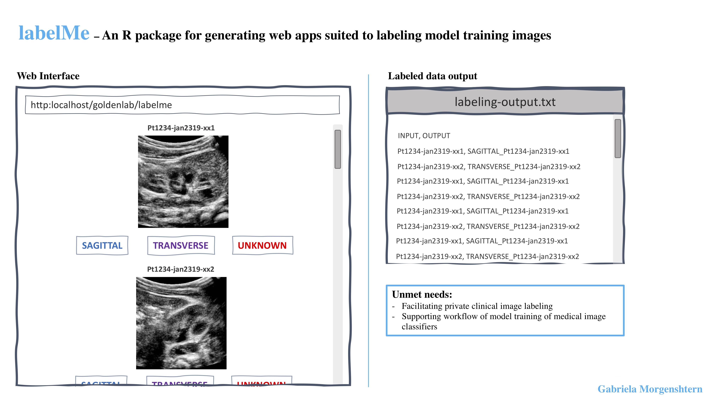

# `labelMe`

&nbsp;

###### [Gabriela Morgenshtern](https://orcid.org/0000-0003-4762-8797),Department of Cells and System Biology, University of Toronto, Canada. &lt;g.morgenshtern@mail.utoronto.ca&gt;


<!-- TOCbelow -->
1. About this package:<br/>
&nbsp;&nbsp;&nbsp;&nbsp;1.1. Overview <br/>
&nbsp;&nbsp;&nbsp;&nbsp;1.2. Installation <br/>
2. Notes<br/>
3. Acknowledgements<br/>
<!-- TOCabove -->

----


# 1 About this package:

## 1.1 Overview
`labelMe` is a package allowing clinicians with test image data that requires manual labeling (ex. ultrasounds) to easily spin up a local webapp to do so, protecting the data's privacy while enabling the interactive convenience of the browser as a platform for this task. This is particularly useful to those who work with image-labeling or -recognition algorithms.



&nbsp;

## 1.2 Installation

**Organize your imaging files in a single directory. Then, install the package, use its functions to set your desired labels and image repository filepath, and run your webapp locally!**

``` r
require("devtools")
install_github("gabmorg/labelMe")
library("TestingPackage")
```

----

# 2 Notes - EDIT 

- **To test functionality** see test images available for upload in the /data directory

&nbsp;

----

# 3 Contributions

The author of this package is Gabriela Morgenshtern. The functions available within this package include:
``` r
library("labelMe")
lsf.str("package:labelMe")
```
- serveMe : function (labelingList) 

The above function, and the helper functions involved in running it were authored by Gabriela Morgenshtern, using the Shiny R package, and with help structuring the app from the Shiny tutorial found on steps 1-6 here: (https://shiny.rstudio.com/tutorial/)

Thanks to Dr. Boris Steipe for providing the skeleton setup for this package through his own template (https://github.com/hyginn/rpt), specific examples of his contribution are denoted in the code. Code for testing Shiny app was borrowed from a Shinytest tutorial by Ferand Dalatieh, specific examples of his contribution are denoted in the code

The rest of the contribution is made by Gabriela.


&nbsp;

<!-- END -->
