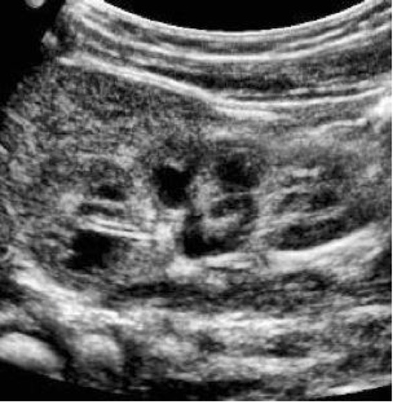

# `labelMe`

&nbsp;

###### [Gabriela Morgenshtern](https://orcid.org/0000-0003-4762-8797),Department of Cells and System Biology, University of Toronto, Canada. &lt;g.morgenshtern@mail.utoronto.ca&gt;


<!-- TOCbelow -->
1. About this package:<br/>
&nbsp;&nbsp;&nbsp;&nbsp;1.1. Description <br/>
&nbsp;&nbsp;&nbsp;&nbsp;1.2. Installation <br/>
&nbsp;&nbsp;&nbsp;&nbsp;1.3. Overview <br/>
&nbsp;&nbsp;&nbsp;&nbsp;1.4. Contributions <br/>
&nbsp;&nbsp;&nbsp;&nbsp;1.5. References <br/>
2. Notes<br/>
&nbsp;&nbsp;&nbsp;&nbsp;2.1 To test functionality <br/>
&nbsp;&nbsp;&nbsp;&nbsp;2.2 To use during workshop <br/>
3. Acknowledgements<br/>
<!-- TOCabove -->

----


# 1 About this package:

## 1.1 Description
`labelMe` is a package allowing clinicians and developers with test image data that requires manual labeling (ex. ultrasounds) to easily spin up a local web application to do so, ensuring data privacy while enabling the interactive convenience of the browser as a platform for this task. This is particularly useful to those who work with image-recognition algorithms. In hospitals, this is commonly a manual workflow, consisting of opening and renaming each DICOM file available for training. Here, the process is significantly more streamlined and sustainable for the 1000s of labels they will have to prepare to train a given algorithm. It also runs entirely locally, so no need to worry about privacy measures for shielding patient data. A secondary tab shows a visualization that allows the user to compare the ratios of images they have labeled so far, so as to aid in creating a balanced test dataset from the labeling effort.

&nbsp;

## 1.2 Installation
```
require("devtools")
devtools::install_github("gabmorg/labelme", build_vignettes = TRUE)
library("labelMe")
```

To run the Shiny app:
```
serveMe(mylabels)
```
Where `mylabels` is a list of lists, containing the desired labels to include
----

## 1.3 Overview
```
browseVignettes("labelMe")
```
This package contains 3 functions that facilitate the preparation of a training dataset of ultrasound images for the purposes of an image labeling algorithm. `startLabeling()` runs the generalized version of the application, and allows a user to specify the labels they desire for the application. `measureLabelRatios()` generates a chart visualizing the proportion of each label selected in the run of the application. `startLabelingGoldenberg()` is a production version of the generalized app, with pre-specified radio labels for specifically kidney ultrasound views. 
Refer to package vignettes for more details. The package tree structure is provided below
``` 
--labelMe/
   |__DESCRIPTION
   |__inst/
      |__available-shiny-apps/
         |__testing-app/
            |__app.R
            |__www/
         |__ultrasound-shiny/
            |__app.R
            |__helpers.R
            |__tests/
               |__mytest-current/
                  |__001.json
                  |__001.png
            |__www/
      |__CITATION
      |__extdata/
         |__MORGENSHTERN_G_A1.png
      |__scripts/
         |__scriptTemplate.R
   |__labelMe.Rproj
   |__LICENSE
   |__man/
      |__serveMe.Rd
      |__startLabelingGoldenberg.Rd
   |__NAMESPACE
   |__NEWS.md
   |__R/
      |__rptTwee.R
      |__serveMe.R
      |__setGlobalVariables.R
      |__startLabelingGoldenberg.R
   |__README.md
   |__tests/
      |__testthat.R
      |__testthat/
         |__helper-test-serveMe.R
         |__test-serveMe.R
```

An overview of the packageis illustrated below.


## 1.4 Contributions

The author of this package is Gabriela Morgenshtern. The functions available within this package include:
```
library("labelMe")
lsf.str("package:labelMe")
```
- startLabeling : function (labelingList)  
- startLabelingGoldenberg : function () 

The above functions, and the helper functions involved in running it were authored by Gabriela Morgenshtern, using the Shiny R package, and with help structuring the app from the Shiny tutorial found on steps 1-6 here: (https://shiny.rstudio.com/tutorial/)

Thanks to Dr. Boris Steipe for providing the skeleton setup for this package through his own template. Starter code for the logic pertaining to pagination of images and radio buttons was found from Stéphane Laurent 

The rest of the contributions are made by Gabriela.

## References

* Attali, D. (2015 April 21). Supplementing your R package with a Shiny app. Retrieved from
https://deanattali.com/2015/04/21/r-package-shiny-app/

* Laurent, S. (2019 September 11). Render images for interactive display from folder loaded with shinyDirChoose [StackOverflow page]. Retrieved from https://stackoverflow.com/questions/57891201/render-images-for-interactive-display-from-folder-loaded-with-shinydirchoose

* Steipe, B. (2019). rpt (R Package Template) [Github page]. Retrieved from https://github.com/hyginn/rpt


## Acknowledgements

This package was developed as part of an assessment for 2019 BCB410: Applied Bioinformatics, University of Toronto, Toronto, CANADA.

----

# 2 Notes 
## 2.1 To test functionality

**TL;DR: Organize your imaging files in a single directory, or group them into several easily-accessible directories. Then, install the package, use the `startLabeling()` function to set your desired labels and run your webapp locally, scrolling between images via the left/right arrow keys**

1. Save the following images to your local machine:



2. To launch the test app (replacing the strings with whatever labels you'd like to apply to the images)

```
labelMe::startLabeling(list(
                        list("test label1A", "test label 1B"), 
                        list("test label2A", "test label 2B")
                        )
                      )
```

## 2.2 To use during workshop
1. Note where images for labeling are located on your local machine

2. Call ```labelMe::startLabelingGoldenberg()``` in an R session to launch the app (within RStudio or Terminal) 

3. Upload the files to the Shiny app using the file browser on the right-hand panel; this will change the label of the *radio button groups* to the name of the uploaded files
- Please note that multiple file upload is not currently supported by the RStudio Viewer, and the app *must be opened in browser* to function. 
- Use ```CTRL + A``` to select all the images in a directory for batch upload

4. Select one option in each column of the radio buttons, according to the image presented on the screen
- Your selected choices are textually summarized below the radio group

5. Press the **<-** and **->** buttons on your keyboard to navigate between images

6. Click the ```"Download DATE-labels.csv"``` button to download the CSV to your local machine. 
- **If using a lab computer**, please create a folder in your *Desktop using your first name*, and save CSVs in there

7. Click ```"flush data"``` to remove labeled images from the (local) server 

8. Repeat steps 3-7 as needed until all images are labeled

&nbsp;

<!-- END -->
